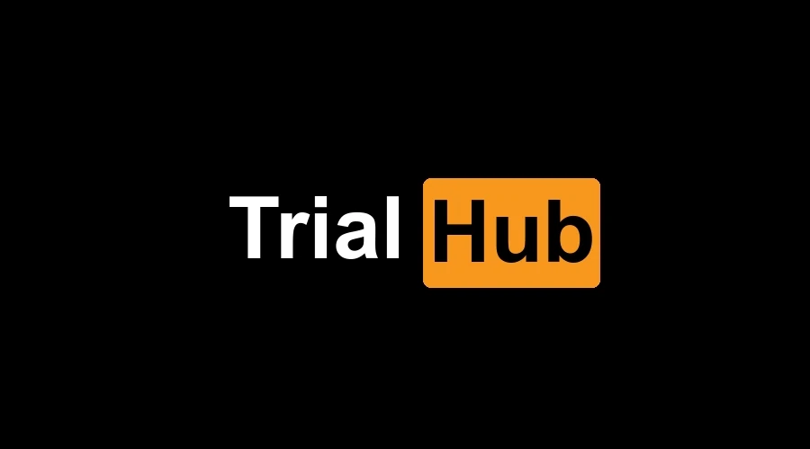

    
    <h3>The place where my unfinished, unpolished, and experimental work is freely explored, refined, and evolved.</h3>

## 🎯 Purpose
#### The primary goal of this repository is to provide a flexible and open environment for my:
- **👾 Experimentation**: Trying out new programming concepts, languages, frameworks, and tools.
- **🪨 Prototyping**: Building quick and dirty prototypes to validate ideas and approaches.
- **📚 Learning**: Practicing coding skills, learning new techniques, and exploring unfamiliar territories.
- **🚀 Innovation**: Fostering creativity and innovation by allowing free-form experimentation.

## 📜 Contents
#### This repository may contain, but is not limited to:

- **⚡ Code Snippets**: Small pieces of code demonstrating specific functionality or solving particular problems.
- **🔥 Algorithms**: Implementations of various algorithms for practice and comparison.
- **📁 Prototype Projects**: Early-stage versions of projects that might not be complete or fully functional.
- **⚙️ Configuration Files**: Sample configuration files for various tools and environments.
- **📝 Documentation**: Notes, comments, and documentation explaining the purpose and functionality of different experiments.
- **🔬 Test Cases**: Unit tests, integration tests, and other forms of testing to validate experimental code.